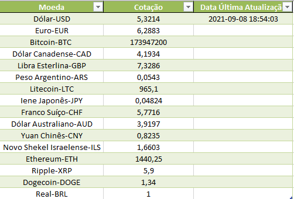
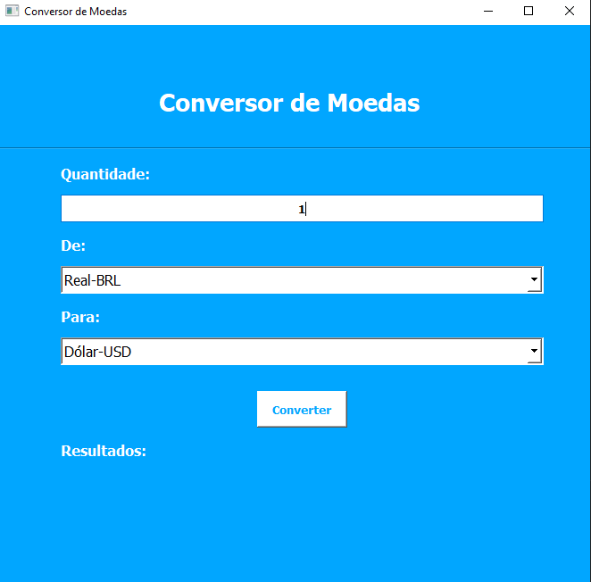

<h1 align="center">Conversor de Moedas<h1>
  
  <h3>Programa para converter moedas em 16 tipos diferentes.<h3>
    
  <h3>Programa desenvolvido com PyQt5, Requisição de API(requests), Pandas<h3>
    
  <h4>A cotação sempre atualiza quando inicia o programa e guarda as cotações em uma tabela Excel.<h4>
    
  
    
<h3>Interface Grafica<h3>

    
  <h3>Lista de moedas:<h3>
  <h5>
  Dólar-USD 
  Euro-EUR 
  Bitcoin-BTC 
  Dólar Canadense-CAD 
  Libra Esterlina-GBP 
  Peso Argentino-ARS 
  Litecoin-LTC 
  Iene Japonês-JPY 
  Franco Suíço-CHF 
  Dólar Australiano-AUD 
  Yuan Chinês-CNY 
  Novo Shekel Israelense-ILS 
  Ethereum-ETH 
  Ripple-XRP 
  Dogecoin-DOGE 
  Real-BRL 
<h5>
